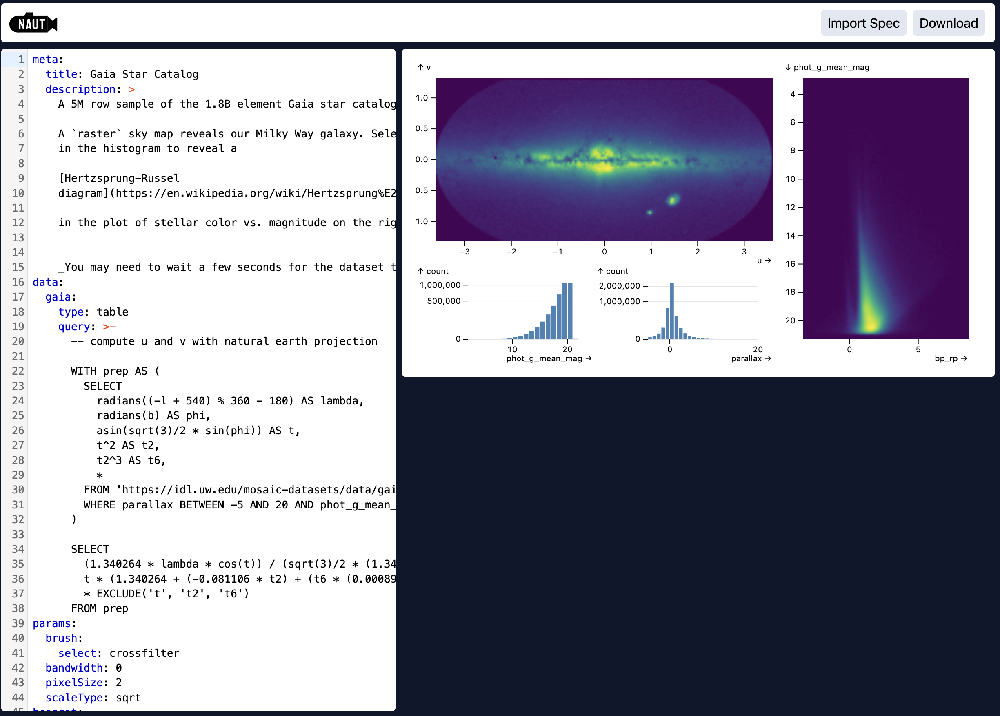

# Nautilus: A tool for developing interactive data visualization, built on Mosaic

Natuilus is a platform for creating and editing interactive data visualization built on top
of [Mosaic](https://idl.uw.edu/mosaic/). In its current form, it provides a YAML 
playground editor and preview for Mosaic Spec.

Playground available at [https://joshisrood.github.io/nautilus/](https://joshisrood.github.io/nautilus/)

## Resources

To learn more about Mosaic Spec, visit the 
[Mosaic documentation page for Mosaic Spec](https://idl.uw.edu/mosaic/spec/) or visit the
[Mosaic GitHub repository](https://github.com/uwdata/mosaic).

## Planned Features (in no particular order or timeline)

* __Mosaic Spec linter__
* __NPM library for rendering specifications__
* __Desktop client__
* __Data connection management__
* __No code user interface__
* __Optional default styling__